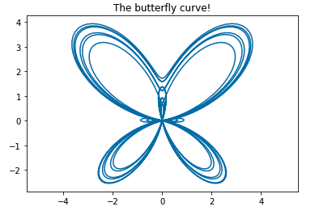
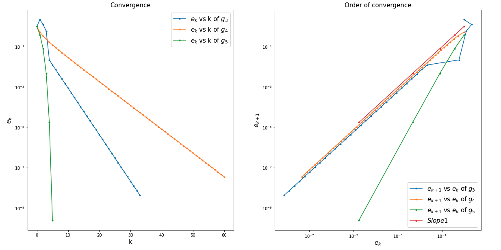

# MAA106 - Introduction to Numerical Analysis 数值分析导入

## Professors
- [Maxime Breden](https://sites.google.com/site/maximebreden/)

## Course Organization
- 7 lectures (2h) and 7 Tutorials (2h) 28 hours in total with 3 ECTS

## 📚 Objective: Introduction to computational mathematics
* Practical knowledge of basic (but fundamental) mathematical algorithms
* Theoretical study: introduction to the notions of error / convergence / speed of convergence
* Practical implementation: lab sessions using Python and Jupyter notebooks

## 📚 Arrangement of this course

* [x] Chapter 0: Introduction to numerical analysis and introduction to **Numpy** and **matplotlib** (1 lec, 1 TD)
* [x] Chapter 1: solving equations of one variable (2 lec, 2 TD)
* [ ] Chapter 2: polynomial approximation (2 lec, 2 TD)
* [ ] Chapter 3: numerical integration (2 lec, 2 TD)

### ✏️  Chapter 0: Introduction to numerical analysis and introduction to **Numpy** and **matplotlib**
- Machine Number
- Introduction to numerical analysis
- Introduction to Numpy and Matplotlib

```python
t = np.linspace(0, 12 * pi, 1000)
x = np.sin(t) * (np.exp(np.cos(t)) - 2 * np.cos(4 * t) + np.sin(t / 12))
y = np.cos(t) * (np.exp(np.cos(t)) - 2 * np.cos(4 * t) + np.sin(t / 12))

plt.figure()
plt.plot(x, y)  # 绘制图像
plt.axis('equal')  # 使x轴和y轴的单位长度相等
plt.title("The butterfly curve!")
plt.show()
```




### ✏️  Chapter 1: solving equations of one variable
- Convergence / order of convergence
- Error estimator
- Stopping criterion
- the bisection method 二分法
```python
# Test for f(x)=x^3-2 on I=[1,2]

xstar = 2**(1.0/3)

# parameters
a0 = 1
b0 = 2
k_max = 100
eps = 0.0000000001

# compute the iterations of the bisection method for I0=[1,2], with guaranteed stopping criterion
x = Bisection(ftest, a0, b0, k_max, eps)

#print x^* and x
print('xstar =', xstar)
print('x =', x)

# create the vector tabk : tabk[k] = k for each iteration made
tabk = np.arange(0, len(x))

# err is a vector, err[k] = |x[k]-x^*|
err = np.abs(x - xstar)
errEstim = (b0 - a0)/(2**tabk) # 也就是beta, error estimator

# plot the error versus k, and the error estimator versus k with the y-axis in log-scale
fig = plt.figure(figsize=(12, 8))
plt.plot(tabk, err, marker="o", label='error')
plt.plot(tabk, errEstim, marker="o", label='Error Estimator')
plt.legend(loc='upper right', fontsize=18)
# set log scale for the error (y-axis)
plt.yscale('log')  # 把y轴变成用log所表示，目的是分别出在error很小的时候的区别
plt.xlabel('$k$', fontsize=18)
plt.ylabel('$error_{k}$', fontsize=18)
# set title of the figure and labels of the axis
plt.title('Convergence of the Bisection Method, $f(x) = x^{3} + 2$', fontsize=18)

plt.show()
```


- Fixed point iterations 定点迭代法
```python
# initialization
x0 = xstar + 1

# parameters for the algorithms
k_max = 100
eps = 1e-8

# computation of the iterates 
x3 = FixedPoint(g3, x0, k_max, eps)
x4 = FixedPoint(g4, x0, k_max, eps)
x5 = FixedPoint(g5, x0, k_max, eps)

# computation of the errors
err3 = abs(x3-xstar)
err4 = abs(x4-xstar)
err5 = abs(x5-xstar)

# the index of each iterate stopping at the appropriate value in each case
tabk3 = np.arange(0, err3.size, dtype='float')
tabk4 = np.arange(0, err4.size, dtype='float')
tabk5 = np.arange(0, err5.size, dtype='float')

fig = plt.figure(figsize=(20, 10))

plt.subplot(121) # plot of e_k versus k for the three cases
plt.plot(tabk3, err3, marker='.', label='$e_{k}$ vs k of $g_{3}$')
plt.plot(tabk4, err4, marker='.', label='$e_{k}$ vs k of $g_{4}$') 
plt.plot(tabk5, err5, marker='.', label='$e_{k}$ vs k of $g_{5}$')
plt.legend(loc='upper right', fontsize=15)
plt.xlabel('k', fontsize=15)
plt.ylabel('$e_{k}$', fontsize=15)
plt.yscale('log') # log scale for the error
plt.title('Convergence', fontsize=15)

plt.subplot(122) # plot of log e_{k+1} versus log e_{k} for the three cases
plt.loglog(err3[:-1:], err3[1:], marker='.', label='$e_{k+1}$ vs $e_{k}$ of $g_{3}$')
plt.loglog(err4[:-1:], err4[1:], marker=".", label='$e_{k+1}$ vs $e_{k}$ of $g_{4}$')
plt.loglog(err5[:-1:], err5[1:], marker=".", label='$e_{k+1}$ vs $e_{k}$ of $g_{5}$')
plt.loglog(err5[:-1:], err5[:-1:], marker=".", label='$Slope 1$')
plt.legend(loc='lower right', fontsize=15)
plt.xlabel('$e_k$', fontsize=15)
plt.ylabel('$e_{k+1}$', fontsize=15)
plt.title('Order of convergence', fontsize=15)

plt.show()
```


- The Newton-Raphson method 牛顿二分法

### ✏️  Chapter 2: polynomial approximation
### ✏️  Chapter 3: numerical integration

## Tools of this course
JupyterLab, Python, Numpy, matplotlib, mathematical analysis

